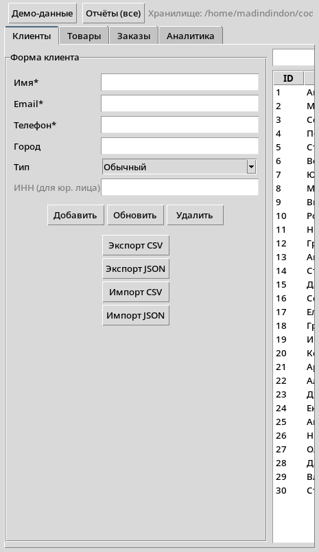
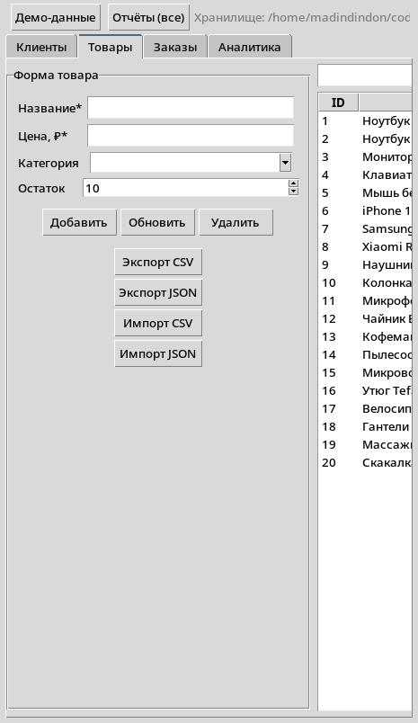
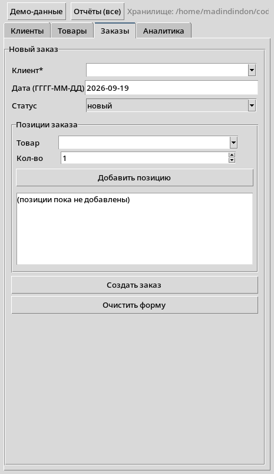
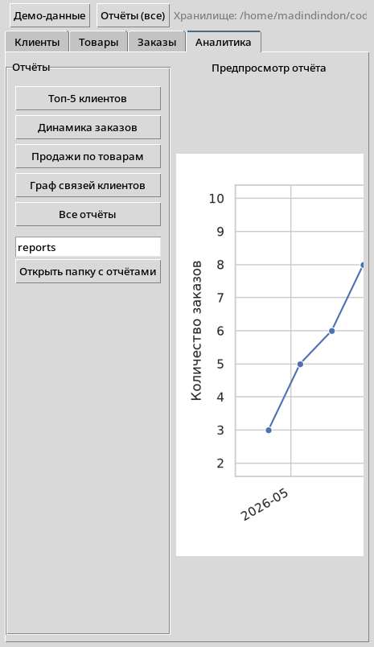
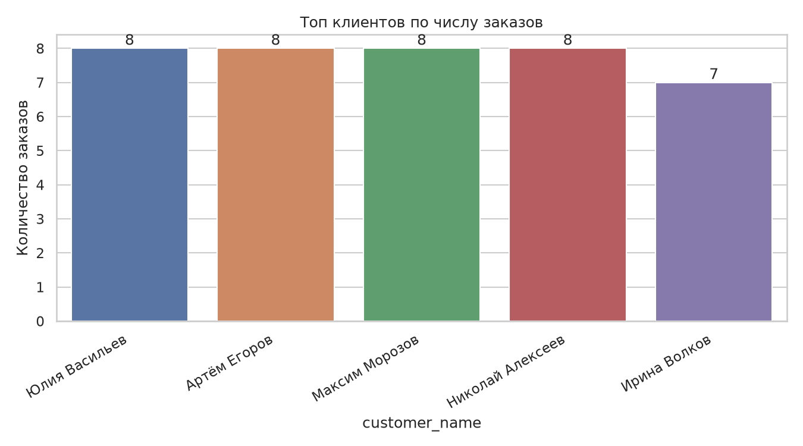
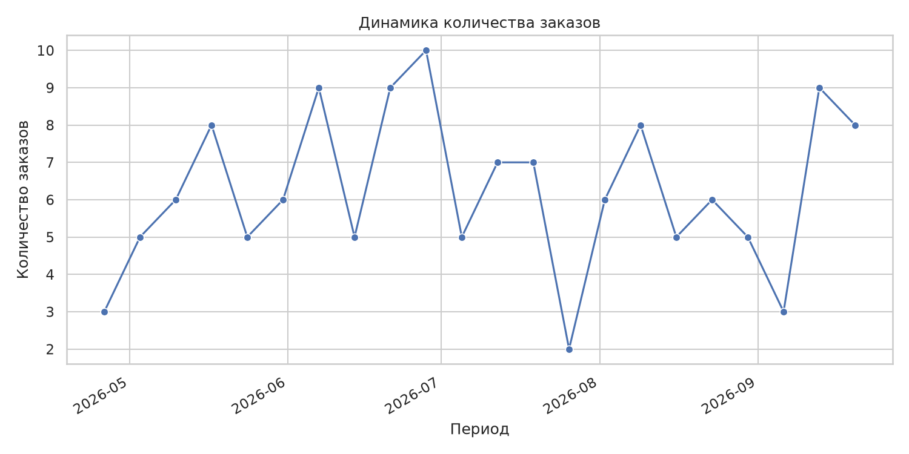
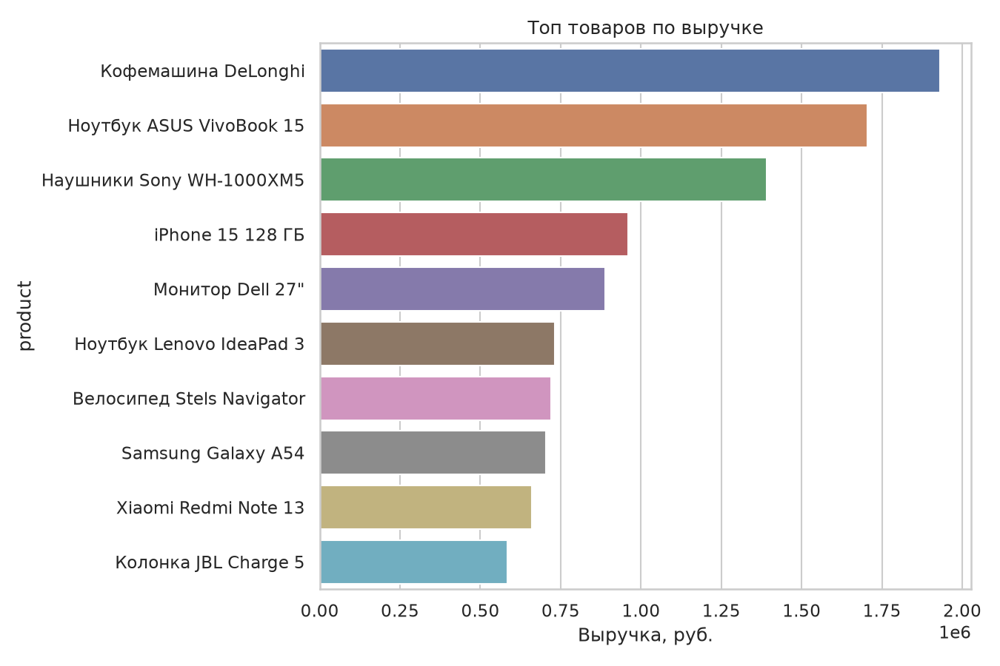
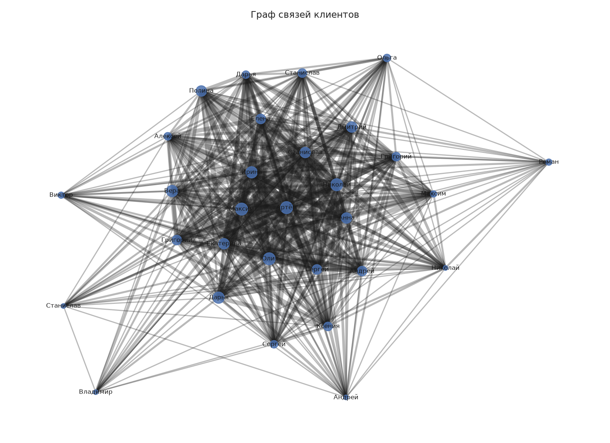

# Система учёта заказов интернет-магазина

Прототип промышленной системы учёта заказов, клиентов и товаров с графическим
интерфейсом (tkinter), хранением данных в Excel (`.xlsx`) и возможностью
анализа и визуализации данных.

Проект выполнен в рамках **итоговой аттестации по Python**.

---

## Возможности

- **Клиенты** — регистрация и редактирование контактных данных, типы клиентов
  (обычный, постоянный, VIP, корпоративный) с персональными скидками.
- **Товары** — каталог с категориями, ценами и остатками на складе.
- **Заказы** — создание заказов с позициями, автоматический расчёт стоимости,
  смена статусов (новый → оплачен → отправлен → завершён), фильтрация,
  поиск и **сортировка по дате/стоимости** (собственный алгоритм).
- **Импорт/экспорт** — данные можно выгружать и загружать в формате
  **XLSX** (клиенты, товары, заказы).
- **Аналитика** — топ-5 клиентов по числу заказов, динамика заказов по датам,
  продажи по товарам, **граф связей клиентов** (общие товары/города).
- **Валидация** — проверка email и номера телефона регулярными выражениями,
  а также запрет дубликатов: у каждого клиента уникальные email и телефон.
- **Обработка ошибок** — `try/except` на всех уровнях, сообщения в GUI.

## Структура проекта

```
order_manager/
├── main.py            # точка входа (CLI: запуск GUI, демо-данные, отчёты)
├── models.py          # классы данных: Product, Customer, Order, Category
├── db.py              # слой хранения: Excel .xlsx, импорт/экспорт XLSX
├── validators.py      # регулярные выражения: email, телефон
├── analysis.py        # анализ и визуализация (pandas, matplotlib, seaborn, networkx)
├── gui.py             # графический интерфейс на tkinter (4 вкладки)
├── requirements.txt   # зависимости
├── tests/             # unit-тесты (unittest): test_models.py, test_db.py, test_analysis.py
├── tools/
│   └── capture_gui.py # служебный скрипт скриншотов GUI
├── data/              # хранилище store.xlsx (создаётся автоматически)
├── reports/           # сгенерированные графики (создаются автоматически)
└── screenshots/       # скриншоты для README
```

### Модули

| Модуль | Назначение |
|---|---|
| `models.py` | Классы предметной области. ООП: инкапсуляция (приватные атрибуты + свойства с валидацией), наследование (`Person → Customer → Regular/VIP/CorporateCustomer`), полиморфизм (`discount()`, `to_dict`/`from_dict`). Рекурсивное дерево категорий (`Category.depth`, `find`). |
| `db.py` | Хранилище на базе рабочей книги Excel: листы `clients`, `products`, `orders`, `order_items`. CRUD, авто-сохранение, импорт/экспорт XLSX, генератор демо-данных. |
| `validators.py` | Проверка email и телефона через `re.fullmatch`, нормализация телефона. |
| `analysis.py` | Расчёты (чистые функции) + построение графиков. Собственная сортировка заказов — рекурсивная сортировка слиянием (`merge_sort_orders`, `sort_orders`). |
| `gui.py` | Вкладки «Клиенты», «Товары», «Заказы», «Аналитика»: формы, списки `Treeview`, поиск, фильтры, кнопки импорта/экспорта, предпросмотр графиков. |
| `main.py` | Точка входа, разбор аргументов командной строки. |

## Установка и запуск

Требуется **Python 3.10+**.

```bash
# 1. Клонировать репозиторий
git clone <URL репозитория>
cd order_manager

# 2. Создать виртуальное окружение и установить зависимости
python -m venv .venv
source .venv/bin/activate            # Windows: .venv\Scripts\activate
pip install -r requirements.txt

# 3. Запустить приложение
python main.py
```

При первом запуске создаётся пустое хранилище `data/store.xlsx` — все данные
добавляются вручную через GUI (либо заполняются демо-набором командой
`python main.py --seed`).

### Команды CLI

```bash
python main.py              # запуск GUI
python main.py --demo       # перезаписать данные демо-набором и запустить GUI
python main.py --seed       # только заполнить хранилище демо-данными
python main.py --reports    # сформировать отчёты в reports/ без GUI
python main.py --path my.xlsx   # использовать другой файл хранилища
```

### Тесты

```bash
python -m unittest discover -s tests -v
```

### Отчёты

```bash
python main.py --reports --reports-dir reports
```

## Скриншоты

Интерфейс:









Отчёты (папка `reports/` / вкладка «Аналитика»):









## Соответствие требованиям ТЗ

| Требование | Реализация |
|---|---|
| Структура проекта | модули `models.py`, `db.py`, `gui.py`, `analysis.py`, `main.py` + `validators.py` |
| ООП: инкапсуляция, наследование, полиморфизм | приватные атрибуты + свойства; иерархия классов клиентов; полиморфные `discount()`, `to_dict/from_dict` |
| Файлы и форматы | импорт/экспорт XLSX; хранение между запусками в `.xlsx` |
| GUI (tkinter) | формы, списки, кнопки, фильтры; добавление клиента, создание заказа, поиск |
| Визуализация и анализ | pandas, matplotlib, seaborn, networkx: топ-5 клиентов, динамика по датам, граф связей |
| Регулярные выражения | `validators.py`: email и телефон |
| Функции и сортировки | параметры, рекурсия (категории, сортировка слиянием), лямбды; своя сортировка заказов по дате/стоимости |
| Обработка ошибок | `try/except` + кастомные исключения `ValidationError`, `StorageError` |
| Unit-тесты | `tests/test_models.py`, `tests/test_db.py`, `tests/test_analysis.py` (unittest, 66 тестов) |
| Документация | docstrings (numpydoc), данный README |
| Контроль версий | git-репозиторий, `.gitignore`, история коммитов |

## Стек

- Python 3.10+
- tkinter (GUI)
- openpyxl (excel-хранилище)
- pandas, matplotlib, seaborn (анализ и графики)
- networkx (граф связей)
- unittest (тестирование)

## Лицензия

MIT — см. [LICENSE](LICENSE).